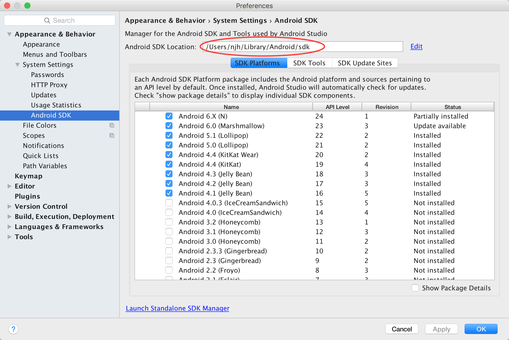
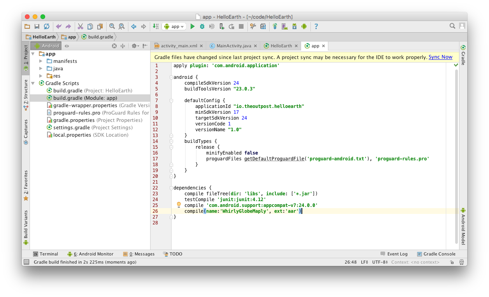

*Tutorial by Nicholas Hallahan.*

Building the toolkit from source you'll be able to modify and customize WhirlyGlobe-Maply, and your changes will immediately be compiled into your project. If you plan on modifying this toolkit, building from source is your best option.

### Clone Git Repository

First you will want to clone the toolkit from Github.

```sh
git clone https://github.com/mousebird/WhirlyGlobe.git
```

The Android portion of the SDK is in the `develop_3_0` branch. Check out this branch.

```sh
cd WhirlyGlobe
git checkout develop_3_0
```

WhirlyGlobe-Maply uses a bunch of submodules for its dependencies.

```sh
git submodule init
git submodule update
```

There are 13 git submodules that need to be cloned and initialized. This usually takes about a minute.

### local.properties

Our build scripts need to know the location of your Android SDK and Android NDK. This is done by creating a `local.properties` file in the `WhirlyGlobe/WhirlyGlobeSrc/Android/` directory. My `local.properties` file is below. Replace these paths to the paths of your Android SDK and NDK respectively.

```
sdk.dir=/Users/njh/Library/Android/sdk
ndk.dir=/usr/local/Cellar/android-ndk/r10e
```

Homebrew usually places packages in `/usr/local/Cellar`. This is a good place to look to find your NDK. You can find the location of your Android SDK your Android Studio Preferences (Android Studio > Preferences):



### Building an AAR

The `.aar` is the binary package container format Android uses, an extension to Java's `.jar` container. Through gradle, we create an AAR of WhirlyGlobe-Maply that you can copy over to your Hello Earth project. First, make sure you are in the Android directory:

```
WhirlyGlobe/WhirlyGlobeSrc/Android
```

Then, execute the `gradlew` build script:

```
./gradlew assemble
```

This will take several minutes. You will be compiling the entirety of WhirlyGlobe-Maply into an AAR file. In fact, there will be two AAR files--one in Debug mode and the other in Release mode.

These AAR files will be located in:

```
WhirlyGlobe/WhirlyGlobeSrc/Android/build/outputs/aar
```

Unless you need to debug the underlying library, you should use the `Android-release.aar` in your Hello Earth project. Keep track of this file, you will need to copy it into your app's project.

### Copy and Include AAR

Copy your `Android-release.aar` that you built into your app's `libs` directory.

```
WhirlyGlobe/WhirlyGlobeSrc/HelloEarth/app/libs
```

Rename it to `WhirlyGlobeMaply.aar`.

Add the following `flatDir` directive to your `Build.gradle (Project: HelloEarth)` file inside of the `allprojects > repositories` directive.

```gradle
allprojects {
    repositories {
        jcenter()
        flatDir {
            dirs 'libs'
        }
    }
}
```


Next add the following packages to the end of the `dependencies` directive in `Build.gradle (Module: app)`.

* `compile 'com.squareup.okhttp:okhttp:2.3.0'`
* `compile(name:'WhirlyGlobeMaply', ext:'aar')`

```gradle
dependencies {
    compile fileTree(dir: 'libs', include: ['*.jar'])
    testCompile 'junit:junit:4.12'
    compile 'com.android.support:appcompat-v7:24.0.0'
    compile 'com.android.support:support-v4:24.0.0'
    compile 'com.squareup.okhttp:okhttp:2.3.0'
    compile(name: 'WhirlyGlobeMaply', ext: 'aar')
}
```

Android Studio will ask you to sync Gradle. If all goes well, it will sync without complaint.



### Example App

Besides this "[Hello Earth](hello-earth.html)" project, there is an example app you can try out called `AutoTesterAndroid`. This is optional, but it is the quickest way to _see something work_. We have [brief instructions](auto-tester-android.html) for you to build AutoTesterAndroid.


