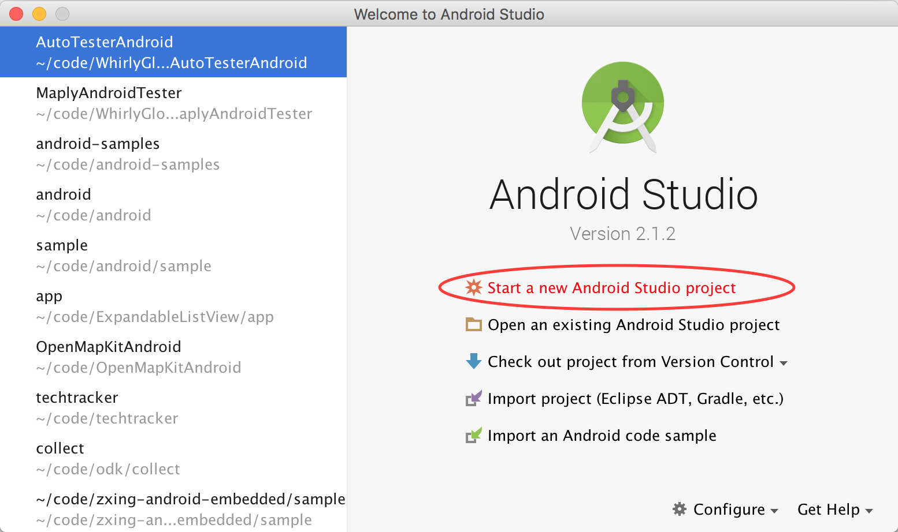
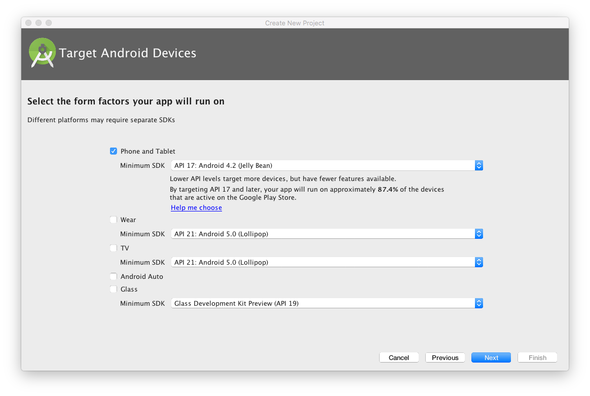
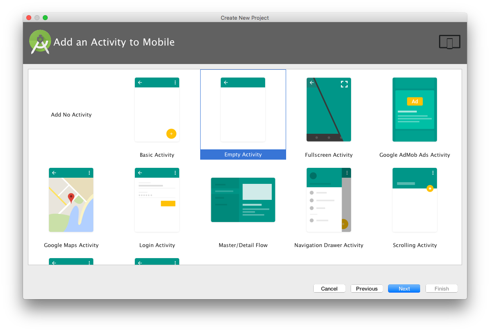
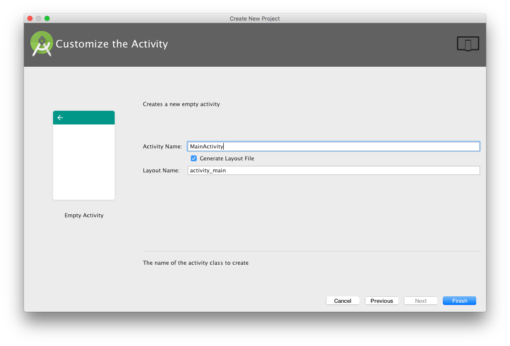

*Tutorial by Nicholas Hallahan.*

Now we will be building a _Hello Earth_ project. Similar to your typical _Hello World_, we will be creating a basic project in Android Studio that displays a globe and map using WhirlyGlobe-Maply.

_Note: You can check out the [completed Android tutorial](https://github.com/mousebird/AndroidTutorialProject) on Github. It includes the WhirlyGlobe-Maply library and everything you need--all you have to do is run it in Android Studio._

### Start New Android Studio Project

Open Android Studio and select _Start a new Android Studio project_.

Name your application `HelloEarth`. Put this application somewhere outside of the WhirlyGlobe git repo.

We're selecting the Minimum SDK to be `API 17: Android 4.2 (Jelly Bean)`. This is the most typical minimum for a project these days. WhirlyGlobe-Maply, however, does support Android SDKs as low as `API 14: Android 4.0 (Ice Cream Sandwich)`.

_Hello Earth_ is a very basic app that is meant to get you started. Select an _Empty Activity_ -- no bells and whistles.

We're going to just have one activity in this app, so keep the default name as `MainActivity`.

Select __Finish__.

### WhirlyGlobe-Maply Distributions

At this point, you have started a new standard project, but you need to add WhirlyGlobe-Maply library as a dependency. 

We distribute the WhirlyGlobe-Maply library in three ways. Any one of them is fine.  Pick the one you are most familiar with.  Don’t care?  Try the repository.

* [Building from Repository](building-from-repository.html) - The self contained binary distribution. This is the stable version.
* [Building from Source](building-from-source.html) - Use the source the code to build your own binary.
* [Building from Nightly version](building-from-nightly.html) - Use the unstable version with the latest and the greatest improvements.

It’s like a pick your own adventure book, but boring.  So just like a pick your own adventure book.
