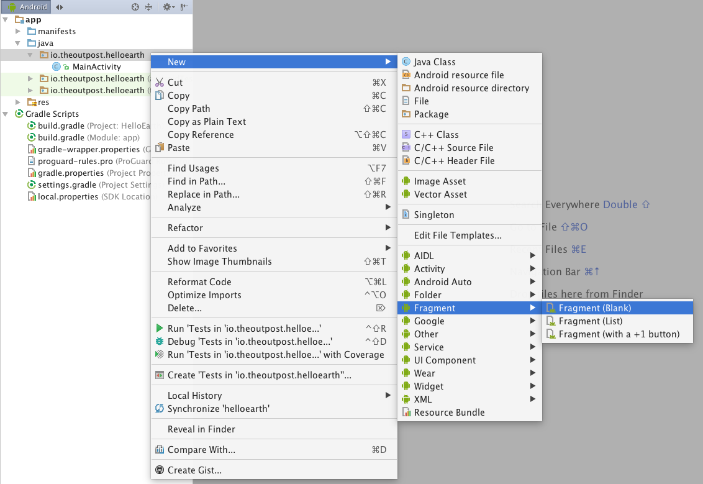
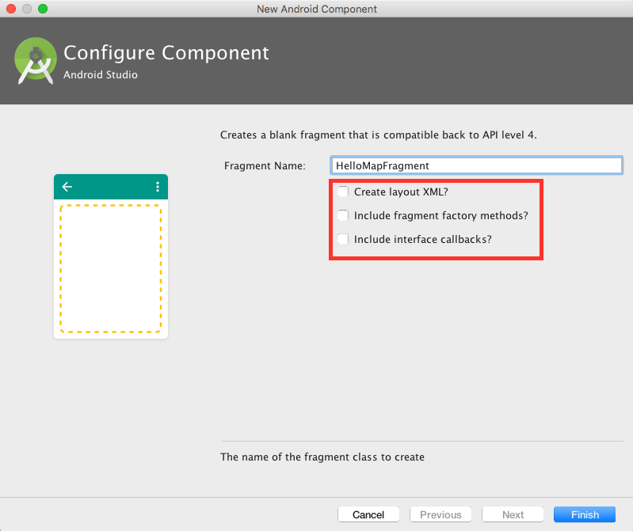

The easiest way to get a map in your app is to create a fragment that extends the `GlobeMapFragment` class. Most of the boilerplate setup work is done for you in `GlobeMapFragment`, and all you have to do is extend several methods from that class for your specific setup.

_Note: If you have already completed [Your First Globe](your-first-globe.html), most of this tutorial is the same. The primary difference is that `MapDisplayType.Map` is the display type in your fragment_.

### Create a Fragment

Right click on the package of your `MainActivity` in the project window. Select a new blank fragment.



Notice that we are not including layout XML. This is because the internal layout of your fragment is already done for you under the hood, by the library. You can optionally include fragment factory methods and interface callbacks, however, you will need to implement those if you want the app to work. For this tutorial, leave those unchecked.



Select __Finish__.

### Include Fragment in Activity XML

Our `HelloMapFragment` will be in our main activity, and it will fill all of the space. 

Open `app/src/main/res/layout/activity_hello_globe.xml`. Delete the padding in the `RelativeLayout` as well as the `TextView`. Inside of the relative layout, place a fragment element as shown below.

_Note: If you have already completed [Your First Globe](your-first-globe.html), you can simply comment out the previous `HelloGlobeFragment` element._

#### activity_main.xml

```xml
<?xml version="1.0" encoding="utf-8"?>
<RelativeLayout xmlns:android="http://schemas.android.com/apk/res/android"
    xmlns:tools="http://schemas.android.com/tools"
    android:layout_width="match_parent"
    android:layout_height="match_parent"
    tools:context="io.theoutpost.helloearth.MainActivity">

    <fragment
        android:layout_width="fill_parent"
        android:layout_height="fill_parent"
        android:name="io.theoutpost.helloearth.HelloMapFragment"
        android:id="@+id/fragment"
        android:layout_centerVertical="true"
        android:layout_centerHorizontal="true" />
</RelativeLayout>
```

When you look in the __Design__ view of the layout xml, don't worry if there is a warning that there is no fragment layout. The fragment's layout is set up for you automatically at runtime.

### Setup HelloMapFragment.java

Open your `HelloMapFragment.java` file and delete the boilerplate code. Replace it with the following:

```java
package io.theoutpost.helloearth;

import android.os.Bundle;
import android.view.LayoutInflater;
import android.view.View;
import android.view.ViewGroup;
import com.mousebird.maply.GlobeMapFragment;
import com.mousebird.maply.QuadImageTileLayer;
import com.mousebird.maply.RemoteTileInfo;
import com.mousebird.maply.RemoteTileSource;
import com.mousebird.maply.SphericalMercatorCoordSystem;

import java.io.File;


public class HelloMapFragment extends GlobeMapFragment {

    @Override
    public View onCreateView(LayoutInflater inflater, ViewGroup container,
                             Bundle inState) {
        super.onCreateView(inflater, container, inState);

        // Do app specific setup logic.

        return baseControl.getContentView();
    }

    @Override
    protected MapDisplayType chooseDisplayType() {
        return MapDisplayType.Map;
    }

    @Override
    protected void controlHasStarted() {
        // setup base layer tiles
        String cacheDirName = "stamen_watercolor";
        File cacheDir = new File(getActivity().getCacheDir(), cacheDirName);
        cacheDir.mkdir();
        RemoteTileSource remoteTileSource = new RemoteTileSource(new RemoteTileInfo("http://tile.stamen.com/watercolor/", "png", 0, 18));
        remoteTileSource.setCacheDir(cacheDir);
        SphericalMercatorCoordSystem coordSystem = new SphericalMercatorCoordSystem();

        // globeControl is the controller when using MapDisplayType.Globe
        // mapControl is the controller when using MapDisplayType.Map
        QuadImageTileLayer baseLayer = new QuadImageTileLayer(mapControl, coordSystem, remoteTileSource);
        baseLayer.setImageDepth(1);
        baseLayer.setSingleLevelLoading(false);
        baseLayer.setUseTargetZoomLevel(false);
        baseLayer.setCoverPoles(true);
        baseLayer.setHandleEdges(true);

        // add layer and position
        mapControl.addLayer(baseLayer);
        mapControl.animatePositionGeo(-3.6704803, 40.5023056, 5, 1.0);
        mapControl.setAllowRotateGesture(true);
    }

}
```

You can download [HelloMapFragment.java](resources/HelloMapFragment.java) and place it directly in your project if you'd like. Notice that it is extending `com.mousebird.maply.GlobeMapFragment`, which is a part of the WhirlyGlobe-Maply library. 

Overridden Methods:

* `onCreateView` sets up and returns the view from the base controller. Here is where you can do custom setup of your fragment.
* `chooseDisplayType` is where you declare if you want a globe or a map. We choose `MapDisplayType.Map`.
* `controlHasStarted` is the final stage where the controller with the OpenGL Surface is ready for final setup.

That's it! You can now build your app. A map with a Stamen Watercolor base layer should appear.


